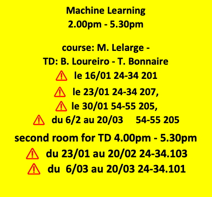

# Machine Learning - [Master ICFP](https://www.phys.ens.fr/en/formations/m2-icfp)

**Prerequisites**:
- Proficiency in Python: please use the tutorial [here](https://cs231n.github.io/python-numpy-tutorial/) for those who aren't as familiar with Python
- Basic Calculus, Linear Algebra
- Basic Probability and Statistics

## 1. Fundamentals of predictions and supervised learning (16/01)

### Fundamentals of predictions
- Minimizing errors
- Modeling knowledge
- Prediction via optimization
- Types of errors and successes
- Properties of ROC curves

### Ref
- [Fundamentals of prediction](https://mlstory.org/prediction.html) from Patterns, Predictions, and Actions (A story about machine learning) by Moritz Hardt and Benjamin Recht

### practicals
- Exact ROC curves for Gaussian mixtures: https://github.com/mlelarge/icfp-ml/blob/main/Exact_ROC_GM.ipynb

### supervised learning
- Sample versus Population
- A first learning algorithm: the perceptron
- Connection to empirical risk minimization
- Formal guarantees for the perceptron

### Ref: 
- [Supervised learning](https://mlstory.org/supervised.html)  from Patterns, Predictions, and Actions (A story about machine learning) by Moritz Hardt and Benjamin Recht

### practicals
- Naive Bayes and logistic regression: https://github.com/mlelarge/icfp-ml/blob/main/01_NaivesBayes_Logistic_empty.ipynb

## 2. Pytorch basics and autodiff (23/01)

[Module 2a - Pytorch tensors](https://dataflowr.github.io/website/modules/2a-pytorch-tensors/)

[Module 2b - Automatic differentiation](https://dataflowr.github.io/website/modules/2b-automatic-differentiation/)

## 3. Optimization for machine learning

- gradient descent
- SGD
- over-parameterized models:https://hackmd.io/@mlelarge/S1y5bEAhj

### Ref: 
- In Chapter 5 (Sections 5.2.1 and 5.4) of [Learning Theory from First Principles](https://www.di.ens.fr/~fbach/ltfp_book.pdf)  by Francis Bach

### practicals
- [Module 5 - Stacking layers](https://dataflowr.github.io/website/modules/5-stacking-layers/)

- Heavy Ball Method: https://github.com/mlelarge/icfp-ml/blob/main/HeavyBall_empty.ipynb

## ${\textsf{\color{lightgrey} 4. Kernels}}$

- Local averaging methods
    - partitions estimators
    - k-nearest neighbors
    - kernel smoothing
- Positive-definite kernel methods
    - representer theorem
    - kernel trick

### practicals
- Kernel with [random Fourier features](https://github.com/mlelarge/icfp-ml/blob/main/03_kernel_random_fourier_empty.ipynb)

## ${\textsf{\color{lightgrey} 5. Unsupervised Learning }}$

- K-means clustering
- Mixtures of Gaussian
- Expectation-Maximization for GMM

### practicals
- SVD
- [Eigenfaces](https://github.com/mlelarge/icfp-ml/blob/main/02_SVD_Eigenfaces_empty.ipynb)

## ${\textsf{\color{lightgrey} 6. Bayesian and Variational Inference }}$

- Gaussian
- Linear regression
- Logistic regression
- Laplace method
- Variational inference
